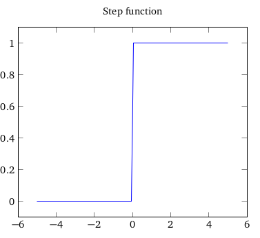
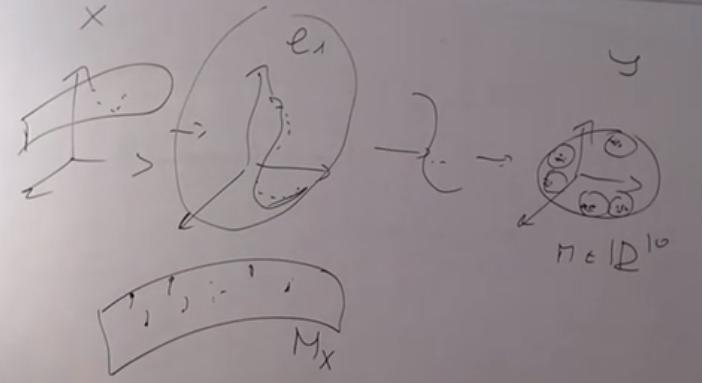

### 1.1 neural network

##### a) perceptron

A **perceptron** is the first type of model of artificial neuron that was developed, but it's not the only one ; nowadays the main neuron model used is one called the **sigmoid neuron**.

A perceptron takes several binary inputs,  $x_1, x_2, ...$  , and produces a single binary output.

Introducing weights $w_1, w_2, ...$  associated to every binary inputs $x_1, x_2, ...$ the **neuron’s output, either 0 or 1**, is determined by **whether** the **weighted sum**  $\sum_j w_j x_j$ is <u>less than or greater than</u> some **threshold value**. This definition can be re-written, first expressing the weighted sum as a dot product of two vectors: $\vec{w}.\vec{x}$=$\sum_j w_j x_j$, and then moving the threshold to the other side of the inequality while replacing it by what’s known as the perceptron’s **bias**, $b=-threshold$ . The bias value defines how easy it is to get the perceptron to "fire", that is to output a 1 instead of a 0.

For perceptrons, if it were true that a small change in a weight (or bias) causes only a small change in output, then we could use this fact to modify the weights and biases to get our network to behave more in the manner we want. For example, suppose the network was mistakenly classifying an image as an “8” when it should be a “9”. We could figure out how to make a small change in the weights and biases so the network gets a little closer to classifying the image as a “9”.
And then we’d repeat this, changing the weights and biases over and over to produce better
and better output. The network would be learning.
The problem is that this isn’t what happens when our network contains perceptrons.
In fact, a small change in the weights or bias of any single perceptron in the network can
sometimes cause the output of that perceptron to completely flip, say from 0 to 1. That
flip may then cause the behaviour of the rest of the network to completely change in some very complicated way.

Sigmoid neurons are similar to perceptrons, but modified so that small changes in their weights and bias cause only a small change in their output.

##### b) sigmoid neuron 

Just like a perceptron, the sigmoid neuron has inputs, $x_1 , x_2 , ...$ . But instead of being just 0
or 1, these **inputs can also take on any values between 0 and 1**. Also just like a perceptron, the sigmoid neuron has weights for each input, $w_1 , w_2 , ...$ , and an overall bias, $b$. But the output is not 0 or 1. Instead, it’s $\sigma(wx + b)$, where the sigmoid function is defined by $\sigma=\frac 1 {1+exp(-\sum_j w_j x_j-b)}$.

In this way, when $\sum_j w_j x_j+b<<0$ then $exp (-\sum_j w_j x_j-b) \longrightarrow \infty$ so that  $\sigma \longrightarrow 0$.

Where the output of the perceptron is sort of a "step function", the sigmoid function has the same tendency but is instead smooth, meaning that small changes $\Delta w_j$ in the weights and $\Delta b$ in the bias will produce a small change $\Delta output$ in the output from the neuron.  That’s the crucial fact which will allow a network of sigmoid neurons to learn.




##### c) network as layers of neurons


Neural networks are made of many neutrons, the first column of perceptrons – what we’ll call the first **layer of perceptrons** – is making three very simple decisions, by weighing the input evidence. Each of those perceptrons of the second layer (second column) is making a decision by weighing up the results from the first layer of decision-making. In this way a perceptron in the second layer can make a decision at a more complex and more abstract level than perceptrons in
the first layer. In this way, a many-layer network of perceptrons can engage in sophisticated decision making.

A perceptron has just a **single output**, the multiple output arrows are merely a useful way of indicating that the output from a perceptron is being used as the input to several other perceptrons.


In the above picture the leftmost layer in this network is called the **input layer**, and the
neurons within the layer are called input neurons. The rightmost or **output layer** contains
the output neurons, or, as in this case, a single output neuron. The middle layer is called a
**hidden layer**, since the neurons in this layer are neither inputs nor outputs.

such multiple layer networks are some-times called **multilayer perceptrons** or **MLPs**, even if they refer to sigmoid neurons.

##### c) Deep feedforward networks or multilayer perceptrons (MLPs)

Deep feedforward networks, also often called feedforward neural networks, or multilayer perceptrons (MLPs), are the quintessential deep learning models. The goal of a feedforward network is to approximate some function $f^*$ . For example, for a classifier,  $y=f^*(x)$ maps an input $x$ to a category $y$ . A feedforward network defines a mapping $y = f (x; \theta)$ and learns the value of the parameters $\theta$ that result in the best function approximation. 

These models are called feedforward because information flows through the function being evaluated from x, through the intermediate computations used to define f , and finally to the output y. There are no feedback connections in whicho utputs of the model are fed back into itself.

Feedforward neural networks are called networks because they are typically represented by composing together many different functions. The model is associated with a directed acyclic graph describing how the functions are composed
together. For example, we might have three functions $f^{ (1)} $, $f^{ (2)}$, and $f^{ (3)}$ connected in a chain, to form $f^{(x)} = f ^{(3)} (f^{ (2) }(f^{ (1)} (x)))$. These chain structures are the most commonly used structures of neural networks. In this case, $f^{(1)}$ is called the **first layer** of the network, $f^{(2)}$ is called the **second layer**, and so on.

The overall length of the chain gives the **depth of the model**. It is from this terminology that
the name “deep learning” arises. The final layer of a feedforward network is called
the **output layer**. During neural network training, we drive f (x) to match $f^*(x)$ .
The training data provides us with noisy, approximate examples of $f^*(x)$ evaluated
at different training points. Each example x is accompanied by a label  $y\simeq f^*(x)$.
The training examples specify directly what the output layer must do at each point
x; it must produce a value that is close to y. The behavior of the other layers is
not directly specified by the training data. The learning algorithm must decide
how to use those layers to produce the desired output, but the training data does
not say what each individual layer should do. Instead, the learning algorithm must
decide how to use these layers to best implement an approximation of $f^* $ . Because
the training data does not show the desired output for each of these layers, these
layers are called **hidden layers**.
Finally, these networks are called neural because they are loosely inspired by
neuroscience. **Each hidden layer of the network is typically vector-valued**. The
**dimensionality of these hidden layers determines the width of the model**. Each
element of the vector may be interpreted as playing a role analogous to a neuron.
Rather than thinking of the layer as representing a single vector-to-vector function,
we can also think of the layer as consisting of many units that act in parallel,
each representing a vector-to-scalar function. Each unit resembles a neuron in
the sense that it receives input from many other units and computes its own
activation value. The idea of using many layers of vector-valued representation
is drawn from neuroscience. The choice of the functions $f^{(i)}(x)$ used to compute
these representations is also loosely guided by neuroscientific observations about
the functions that biological neurons compute. However, modern neural network
research is guided by many mathematical and engineering disciplines, and the
goal of neural networks is not to perfectly model the brain. It is best to think of
feedforward networks as function approximation machines that are designed to
achieve statistical generalization, occasionally drawing some insights from what we
know about the brain, rather than as models of brain function.
One way to understand feedforward networks is to begin with linear models
and consider how to overcome their limitations. **Linear models, such as logistic**
**regression and linear regression, are appealing because they may be fit efficiently**
**and reliably, either in closed form or with convex optimization. Linear models also**
**have the obvious defect that the model capacity is limited to linear functions, so**
**the model cannot understand the interaction between any two input variables.**
To extend linear models to represent nonlinear functions of x, we can apply
the linear model not to x itself but to a transformed input φ(x), where φ is a
nonlinear transformation. Equivalently, we can apply the kernel trick described in
section 5.7.2 , to obtain a nonlinear learning algorithm based on implicitly applying
the φ mapping. We can think of φ as providing a set of features describing x, or
as providing a new representation for x .

To make the idea of a feedforward network more concrete, we begin with an
example of a fully functioning feedforward network on a very simple task: learning
the XOR function.
The XOR function (“exclusive or”) is an operation on two binary values, x 1
and x 2 . When exactly one of these binary values is equal to 1 , the XOR function
returns 1 . Otherwise, it returns 0. The XOR function provides the target function
y = f ∗ (x) that we want to learn. Our model provides a function y = f(x;θ) and
our learning algorithm will adapt the parameters θ to make f as similar as possible
to f ∗ . We can treat this problem as a regression problem and use a mean squared
error loss function. We choose this loss function to simplify the math for this
example as much as possible. In practical applications, MSE is usually not an appropriate cost function for modeling binary data. [...] 

Now, we describe an affine transformation from a vector x to a vector h, so an entire vector of bias parameters is needed. The activation function g is typically chosen to be a function that is applied element-wise, with $h_i = g(x^T W_{:,i} + c_i)$ . In modern neural networks, the default recommendation is to use the rectified linear unit or ReLU defined by the activation function $g ( z ) = max ( 0 , z )$

##### c) using networks of perceptrons to compute logical function

Then we see that input $(x_1,x_2)=(0,0)$ for the weights $(w_1,w_2)=(-2,-2)$ produces output 1, since $(−2) \times 0 + (−2) \times 0 + 3 = 3$ is positive. Similar calculations show that the inputs (0,1) and (1,0) produce output 1. But the input (1,1 produces output 0, since $( −2) ∗ 1 + (−2) ∗ 1 + 3 = −1$ is negative. And so our perceptron implements a NAND gate! The NAND example shows that we can use perceptrons to compute simple logical functions. In fact, we can use networks of perceptrons to compute any logical function at all.

##### d) classifying handwritten digits

We can split the problem of recognizing handwritten digits into two sub-problems. 

- First, we’d like a way of breaking an image containing many digits into a sequence of separate 28 by 28 pixel images, each containing a single digit. 
- Then the classification of the individual digits:
  -  the input layer contains 784 = 28 × 28 neurons to handle once at a time the 28 by 28 pixel images.
  - for the hidden layer, 15 neurons are enough
  - the output layer of the network contains 10 neurons. If the first neuron fires, i.e., has
    an output ≈ 1, then that will indicate that the network thinks the digit is a 0. If the second
    neuron fires then that will indicate that the network thinks the digit is a 1. And so on up to the 10$^{th}$neuron identifying the digit as a 9. A little more precisely, we number the output neurons from 0 through 9, and figure out which neuron has the highest **activation value** (which is a float value). A seemingly natural way of doing that is to use just 4 output neurons, treating each neuron as taking on a binary value, depending on whether the neuron’s output is closer to 0 or to 1. Four neurons are enough to encode the answer, since 24 = 16 is more than the 10 possible values for the input digit. *Why should our network use 10 neurons instead? Isn’t that inefficient? The ultimate justification is empirical: we can try out both network designs, and it turns out that, for this particular problem, the network with 10 output neurons learns to recognize digits better than the network with 4 output neurons*

##### Cost function and gradient descent

The gradient descent is an algorithm which lets us find weights and biases so that the output
from the network approximates y(x) for all training inputs x. It consists in minimizing the cost function $C(w,b)=\frac 1 {2n} \sum_n |y(x_n)-a(x,w,b)|$ where w denotes the collection of all weights in the network, b all the biases, n is the total number of training inputs, a is the vector of outputs from the network when x is input, and the sum is over all training inputs, x

In the code that follows, the training_data is a list of tuples (x, y) representing the training inputs and corresponding desired outputs. The variables epochs and mini_batch_size are what you’d expect – the number of epochs to train for, and the size of the mini-batches to use when sampling. eta is the learning rate, $\eta$. If the optional argument test_data is supplied, then the program will evaluate the network after each epoch of training, and print out partial progress. This is useful for tracking progress, but slows things down substantially.
The code works as follows. In each epoch, it starts by randomly shuffling the training
data, and then partitions it into mini-batches of the appropriate size. This is an easy way of
sampling randomly from the training data. Then for each mini_batch we apply a single
step of gradient descent. This is done by the code self.update_mini_batch(mini_batch
, eta) , which updates the network weights and biases according to a single iteration
of gradient descent, using just the training data in mini_batch . Here’s the code for the
update_mini_batch method:

```python
"""
network.py
~~~~~~~~~~
A module to implement the stochastic gradient descent learning
algorithm for a feedforward neural network.  Gradients are calculated
using backpropagation.  Note that I have focused on making the code
simple, easily readable, and easily modifiable.  It is not optimized,
and omits many desirable features.
"""

#### Libraries
# Standard library
import random

# Third-party libraries
import numpy as np

class Network(object):

    def __init__(self, sizes):
        """The list ``sizes`` contains the number of neurons in the
        respective layers of the network.  For example, if the list
        was [2, 3, 1] then it would be a three-layer network, with the
        first layer containing 2 neurons, the second layer 3 neurons,
        and the third layer 1 neuron.  The biases and weights for the
        network are initialized randomly, using a Gaussian
        distribution with mean 0, and variance 1.  Note that the first
        layer is assumed to be an input layer, and by convention we
        won't set any biases for those neurons, since biases are only
        ever used in computing the outputs from later layers."""
        self.num_layers = len(sizes)
        self.sizes = sizes
        self.biases = [np.random.randn(y, 1) for y in sizes[1:]]
        self.weights = [np.random.randn(y, x)
                        for x, y in zip(sizes[:-1], sizes[1:])]

    def feedforward(self, a):
        """Return the output of the network if ``a`` is input."""
        for b, w in zip(self.biases, self.weights):
            a = sigmoid(np.dot(w, a)+b)
        return a

    def SGD(self, training_data, epochs, mini_batch_size, eta,
            test_data=None):
        """Train the neural network using mini-batch stochastic
        gradient descent.  The ``training_data`` is a list of tuples
        ``(x, y)`` representing the training inputs and the desired
        outputs.  The other non-optional parameters are
        self-explanatory.  If ``test_data`` is provided then the
        network will be evaluated against the test data after each
        epoch, and partial progress printed out.  This is useful for
        tracking progress, but slows things down substantially."""
        if test_data: n_test = len(test_data)
        n = len(training_data)
        for j in xrange(epochs):
            random.shuffle(training_data)
            mini_batches = [
                training_data[k:k+mini_batch_size]
                for k in xrange(0, n, mini_batch_size)]
            for mini_batch in mini_batches:
                self.update_mini_batch(mini_batch, eta)
            if test_data:
                print "Epoch {0}: {1} / {2}".format(
                    j, self.evaluate(test_data), n_test)
            else:
                print "Epoch {0} complete".format(j)

    def update_mini_batch(self, mini_batch, eta):
        """Update the network's weights and biases by applying
        gradient descent using backpropagation to a single mini batch.
        The ``mini_batch`` is a list of tuples ``(x, y)``, and ``eta``
        is the learning rate."""
        nabla_b = [np.zeros(b.shape) for b in self.biases]
        nabla_w = [np.zeros(w.shape) for w in self.weights]
        for x, y in mini_batch:
            delta_nabla_b, delta_nabla_w = self.backprop(x, y)
            nabla_b = [nb+dnb for nb, dnb in zip(nabla_b, delta_nabla_b)]
            nabla_w = [nw+dnw for nw, dnw in zip(nabla_w, delta_nabla_w)]
        self.weights = [w-(eta/len(mini_batch))*nw
                        for w, nw in zip(self.weights, nabla_w)]
        self.biases = [b-(eta/len(mini_batch))*nb
                       for b, nb in zip(self.biases, nabla_b)]

    def backprop(self, x, y):
        """Return a tuple ``(nabla_b, nabla_w)`` representing the
        gradient for the cost function C_x.  ``nabla_b`` and
        ``nabla_w`` are layer-by-layer lists of numpy arrays, similar
        to ``self.biases`` and ``self.weights``."""
        nabla_b = [np.zeros(b.shape) for b in self.biases]
        nabla_w = [np.zeros(w.shape) for w in self.weights]
        # feedforward
        activation = x
        activations = [x] # list to store all the activations, layer by layer
        zs = [] # list to store all the z vectors, layer by layer
        for b, w in zip(self.biases, self.weights):
            z = np.dot(w, activation)+b
            zs.append(z)
            activation = sigmoid(z)
            activations.append(activation)
        # backward pass
        delta = self.cost_derivative(activations[-1], y) * \
            sigmoid_prime(zs[-1])
        nabla_b[-1] = delta
        nabla_w[-1] = np.dot(delta, activations[-2].transpose())
        # Note that the variable l in the loop below is used a little
        # differently to the notation in Chapter 2 of the book.  Here,
        # l = 1 means the last layer of neurons, l = 2 is the
        # second-last layer, and so on.  It's a renumbering of the
        # scheme in the book, used here to take advantage of the fact
        # that Python can use negative indices in lists.
        for l in xrange(2, self.num_layers):
            z = zs[-l]
            sp = sigmoid_prime(z)
            delta = np.dot(self.weights[-l+1].transpose(), delta) * sp
            nabla_b[-l] = delta
            nabla_w[-l] = np.dot(delta, activations[-l-1].transpose())
        return (nabla_b, nabla_w)

    def evaluate(self, test_data):
        """Return the number of test inputs for which the neural
        network outputs the correct result. Note that the neural
        network's output is assumed to be the index of whichever
        neuron in the final layer has the highest activation."""
        test_results = [(np.argmax(self.feedforward(x)), y)
                        for (x, y) in test_data]
        return sum(int(x == y) for (x, y) in test_results)

    def cost_derivative(self, output_activations, y):
        """Return the vector of partial derivatives \partial C_x /
        \partial a for the output activations."""
        return (output_activations-y)

#### Miscellaneous functions
def sigmoid(z):
    """The sigmoid function."""
    return 1.0/(1.0+np.exp(-z))

def sigmoid_prime(z):
    """Derivative of the sigmoid function."""
    return sigmoid(z)*(1-sigmoid(z))
```

##### Relu

**ReLU** stands for rectified linear unit, and is a type of **activation function**. Mathematically, it is defined as y = max(0, x). ... **ReLU** is the most commonly used **activation function** in neural networks, especially in CNNs. If you are unsure what **activation function** to use in your network, **ReLU** is usually a good first choice.


ReLU is linear (identity) for all positive values, and zero for all negative values. This means that:

- It’s cheap to compute as there is no complicated math. The model can therefore take less time to train or run.
- It converges faster. Linearity means that the slope doesn’t plateau, or “saturate,” when *x* gets large. It doesn’t have the vanishing gradient problem suffered by other activation functions like sigmoid or tanh.
- It’s  sparsely activated. Since ReLU is zero for all negative inputs, it’s  likely for any given unit to not activate at all. This is often  desirable (see below).

##### Dropout

The idea it to shutdown some of the connections during the forward path `x ---> ^y`

We want to shutdown with a given probability, `p`, which is one of the parameters of the training (one of the hyper-parameters). It's not a trained parameter like the bias `b` that can change during the training.

We train the network with input data called mini batch  : `mb`.

In the input space we will have several data manifolds, that are ensembles of points. 

We will consequently have data manifolds in the space of the hidden layers, as well as manifolds in the output space. 



We will have  a much lower dimensionality across the network than the space that is hosting them, i.e. the dimensionality of the input layer will be higher than the dimensionality of the layers inside the network.

##### Embedding

The embedding  `EMB : T-SNE`  helps to make sense to the very high dimensional representation. 


*The `PCA` is another option to reduce the dimensionality of the space, but it often fails because it relies on the assumption of data lying close to the Hilbert planes, that's why other non linear methods are more suitable.*

SVCCA Singular Value Canonical Correlation Analysis, as well as PWCCA or CKA techniques are developed for evaluating how similar are the representation of two different layers:


Let's imagine we train our network with many layers using different MNIST handwritten digits datasets.

##### Transfer learning

To recognize the hand written digits we can take the network already trained by MNIST-1 (e.g. `6`), reinitialize the connections between the last hidden layer (the one on the right hand side) and the output, keeping all the other layers (the connections between the left hand side ones layers) as frozen., and then train it with the other dataset MNIST-2 (e.g `S`).


having trained the network with MNIST and frozen $ x \longrightarrow h^L$ obtained after the training,  we can focus then on solving $h^L \longleftrightarrow y$ for any other dataset MNIST*.

We're assuming that there is some shared structure on the image, but given that the difference between the tasks is obtained in the very last hidden layers, we can freeze the first ones once they've been trained on one dataset.

##### Convolution


Using different filters 

- $W^{(1)}=w_1^{(1)}, w_2^{(1)},...,w_9^{(1)}$ where the $w_i$ = either $1$ or $0$
- $W^{(2)}=w_1^{(1)}, w_2^{(1)},...,w_9^{(1)}$

We can extract as many feature maps of the image as we have filters.

Every feature map is actually an image itself computed fro the original image by applying a given filter


The parameters of the units of a single feature map are shared. 

For every feature maps (whose units share the same bias), every unit has the same number of input parameters ($3\times3=9+1=10$ for a 3x3 filter, the $+1$ is given by the bias)

The feature map is done  writing in every "pixel" of the output matrix the matrix product of the filter by the peace of the original matrix associated to the pixel of the hidden layer.

Then taking the `max` value of the feature map is equivalent to a logical `IF` checking if the shape evidentiated by the filter is present in the original image.


##### Autoencoder

Autoencoders  are surprisingly simple neural architectures. They are basically a form  of compression, similar to the way an audio file is compressed using  MP3, or an image file is compressed using JPEG.


Autoencoders  are closely related to principal component analysis (PCA). In fact, if  the activation function used within the autoencoder is linear within  each layer, the latent variables present at the bottleneck (the smallest  layer in the network, aka. code) directly correspond to the principal  components from PCA. Generally, the activation function used in  autoencoders is non-linear, typical activation functions are ReLU  (Rectified Linear Unit) and sigmoid.

The  math behind the networks is fairly easy to understand, so I will go  through it briefly. Essentially, we split the network into two segments,  the encoder, and the decoder.

$ \phi : X \rightarrow F \\ \psi : F \rightarrow X \\ \phi, \psi = argmin_{\phi,\psi}||X-(\psi \text{ o } \phi)X||^2$

The encoder function, denoted by *ϕ,* maps  the original data X, to a latent space F, which is present at the  bottleneck. The decoder function, denoted by ψ, maps the latent space F  at the bottleneck to the output. The output, in this case, is the same  as the input function. Thus, we are basically trying to recreate the  original image after some generalized non-linear compression.

The encoding network can be represented by the standard neural network function passed through an activation function, where **z** is the latent dimension.

$$z = \sigma(Wx+b)$$

Similarly, the decoding network can be represented in the same fashion,  but with different weight, bias, and potentially activation functions  being used:

$$x'=\sigma'(W'z+b')$$

The loss function can then be written in terms of these network 
functions, and it is this loss function that we will use to train the 
neural network through the standard backpropagation procedure:

$$L(x,x')=||x-x'||^2=||x-\sigma'(W'(\sigma(Wx+b))+b')||^2$$

Since  the input and output are the same images, this is not really supervised  or unsupervised learning, so we typically call this self-supervised  learning. The aim of the autoencoder is to select our encoder and  decoder functions in such a way that we require the minimal information  to encode the image such that it be can regenerated on the other side.

If  we use too few nodes in the bottleneck layer, our capacity to recreate  the image will be limited and we will regenerate images that are blurry  or unrecognizable from the original. If we use too many nodes, then  there is little point in using compression at all.

The  case for compression is pretty simple, whenever you download something  on Netflix, for example, the data that is sent to you is compressed.  Once it arrives at your computer, it is passed through a decompression  algorithm and then displayed on your computer. This is analogous to how  zip files work, except it is done behind the scenes via a streaming  algorithm.